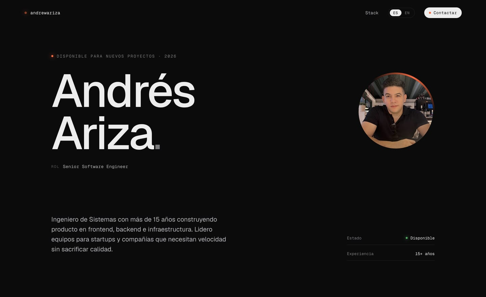
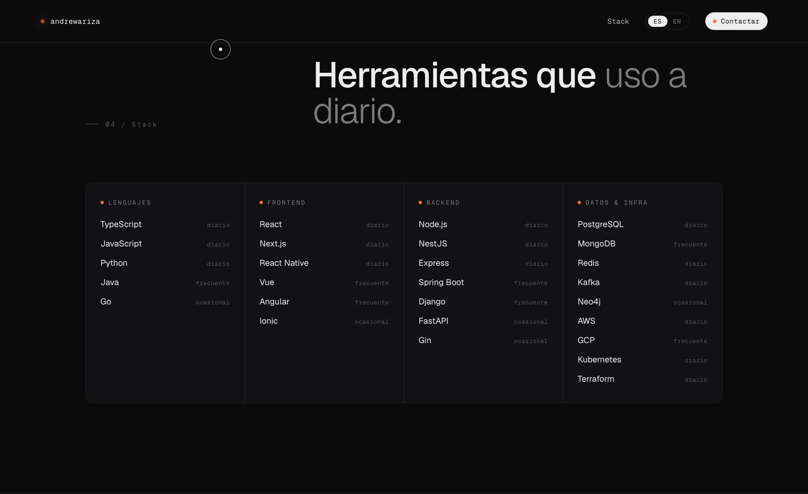

<div align="center">

# andrewariza.github.io

**Andrés Ariza's personal portfolio** — Senior Software Engineer
Bilingual (ES/EN) static site, dark, no UI framework.

[**andrewariza.github.io**](https://andrewariza.github.io) · [Español](https://andrewariza.github.io) · [LinkedIn](https://linkedin.com/in/AndresAriza) · [GitHub](https://github.com/AndrewAriza) · [andrewariza.dev@gmail.com](mailto:andrewariza.dev@gmail.com)

[](https://github.com/AndrewAriza/AndrewAriza.github.io/actions/workflows/deploy.yml)




</div>

---

## What it is

Single-page portfolio built with **Astro 7** in static mode. The HTML is pre-rendered and
the three interactions (cursor, scroll reveal, blurred nav) are TypeScript modules that
Astro inlines in **1.3 kB**.

| Asset | Uncompressed | gzip |
| :-- | --: | --: |
| `index.html` (inline JS included) | 11.5 kB | **3.5 kB** |
| CSS (Geist `@font-face` included) | 17.4 kB | **4.4 kB** |
| External JS | — | **0 B** |

## Features

- **Two routes, two languages** — `/` in Spanish and `/en/` in English, both pre-rendered. The `ES / EN` toggle is made of real links, so Google indexes both versions.
- **Custom cursor** — dot + ring with interpolation (`lerp` 0.18) that grows over interactive elements and turns into a caret over text.
- **Scroll reveal** — `IntersectionObserver` with delays staggered via `data-delay`.
- **Design details** — SVG grain over the background, infinite stack marquee, conic ring spinning around the photo, pulsing *live* indicator.
- **Accessible** — Lighthouse a11y 100: AA contrast, visible `focus-visible`, accessible names that contain the visible text, `prefers-reduced-motion` honored.
- **Self-hosted fonts** — Geist and Geist Mono variable from Fontsource, with the latin subset preloaded. Zero Google Fonts calls.
- **Optimized images** — `astro:assets` + sharp emit WebP at 1x and 2x.
- **Script-generated assets** — `og.png` (1200×630) and the favicon set come from a single SVG, not from hand-made files.



## SEO

Lighthouse **SEO 100 · Accessibility 100 · Best Practices 100** (mobile, measured on the build).

| Signal | Implementation |
| :-- | :-- |
| Crawlability | `robots.txt` + `<meta name="robots" content="index, follow, max-image-preview:large">` |
| Sitemap | `@astrojs/sitemap` → `/sitemap-index.xml` with per-language `xhtml:link` |
| Canonicals | Self-referencing, one per route |
| Multi-language | `hreflang` es / en / `x-default` on both pages |
| Social | Full Open Graph (`og:locale`, `og:image` plus dimensions and alt) and `summary_large_image` |
| Icons | `favicon.ico`, `favicon.svg`, and `apple-touch-icon.png` as crawlable files |
| Semantics | One `h1` carrying the role, `h2` per section, `h3` per stack column |

## Stack

| Layer | Choice |
| :-- | :-- |
| Framework | Astro 7 (`output: static`, `i18n` with `prefixDefaultLocale: false`) |
| Language | Strict TypeScript |
| Styles | Plain CSS with custom properties, no preprocessor |
| Type | Geist + Geist Mono variable (Fontsource, self-hosted) |
| Images | `astro:assets` + sharp |
| Hosting | GitHub Pages via GitHub Actions |

## Structure

```text
src/
├─ data/content.ts           ES/EN copy + LOCALES (language → route) — source of truth
├─ layouts/BaseLayout.astro  head, meta/OG/hreflang, favicons, loader, cursor
├─ components/
│  ├─ Page.astro             Assembles the full page for one language
│  └─ …                      Nav · Hero · Marquee · About · Stack · Contact · Footer
├─ pages/
│  ├─ index.astro            / → <Page lang="es" />
│  └─ en/index.astro         /en/ → <Page lang="en" />
├─ scripts/
│  ├─ main.ts                Entry: blurred nav + loader
│  ├─ cursor.ts              Custom cursor
│  └─ reveal.ts              Scroll reveal
├─ styles/global.css         Design tokens + every section's styles
└─ assets/profile.jpg        Hero photo (optimized at build time)

public/                      robots.txt · og.png · favicon.ico/.svg · apple-touch-icon.png
scripts/og.mjs               Generates public/og.png with sharp
scripts/icons.mjs            Generates the favicon set from an SVG
.github/workflows/deploy.yml Build + deploy to GitHub Pages
```

## Commands

| Command | What it does |
| :-- | :-- |
| `pnpm dev` | Dev server on `localhost:4321` |
| `pnpm build` | Static build into `dist/` (2 pages + sitemap) |
| `pnpm preview` | Serves `dist/` the way production does |
| `pnpm check` | `astro check` — types and templates |
| `pnpm og` | Regenerates `public/og.png` |
| `pnpm icons` | Regenerates `favicon.ico`, `favicon.svg`, and `apple-touch-icon.png` |
